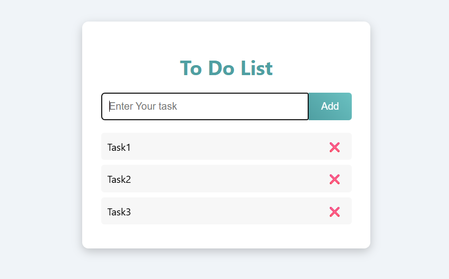

# Vanilla-JS-ToDo-List
# Vanilla JavaScript ToDo List 📝

A simple and clean To-Do List application built using **Vanilla JavaScript**.

This project was created to practice JavaScript fundamentals such as DOM manipulation, events, and clean code structure.

---

## ✨ Features

- Add new tasks
- Delete tasks
- Mark tasks as completed
- Keyboard support (press **Enter** to add task)
- Simple and clean UI

---

## 🛠 Technologies Used

- HTML5
- CSS3
- JavaScript (Vanilla JS)

## Screenshot

## 🌐 Live Demo
Check it out here: [Live Demo](https://emantarek48.github.io/Vanilla-JS-ToDo-List/)

## 📂 Project Structure

